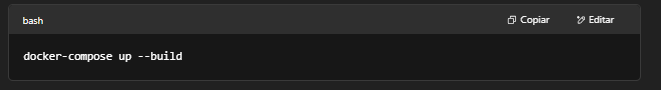
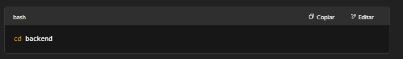
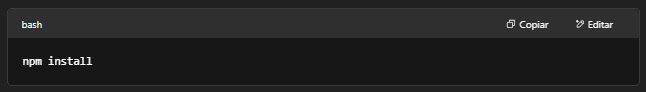
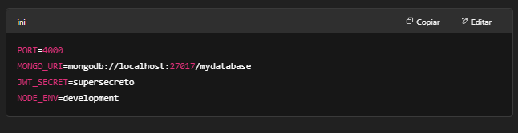
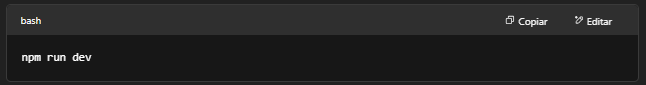
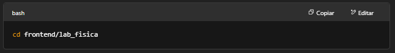
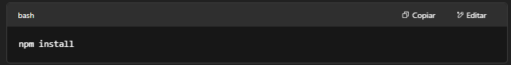
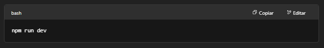

# Laboratorio de Física
# Descripción
El presente proyecto tiene como objetivo diseñar e implementar un sistema web para la gestión del préstamo de equipos del Laboratorio de Física de la Universidad Católica de Pereira. El sistema permitirá registrar productos, gestionar préstamos y devoluciones, generar recibos automáticos y visualizar estadísticas de uso en una interfaz accesible, dinámica y segura.

El proyecto especifica el uso de MongoDB y Mongoose; sin embargo, cada grupo podrá trabajar con MySQL en lugar de MongoDB si lo considera pertinente.

#Tecnologías
Frontend: React, React Router, Tailwind CSS, React Hook Form, Axios, Framer Motion

#Backend: Node.js, Express, MongoDB, Mongoose, JWT (JSON Web Tokens), Multer

#Contenedores: Docker, Docker Compose

#Otros: Context API para manejo de estado, autenticación con roles

#Estructura del Proyecto
bash
Copiar
Editar
/backend      # Código backend (API REST con Express, MongoDB, autenticación JWT)
/frontend/lab_fisica  # Código frontend (React, rutas protegidas, gestión de estado)
/docker-compose.yml   # Configuración de contenedores Docker
Roles y Seguridad
El sistema maneja tres tipos de usuarios:

admin: Acceso completo, puede administrar equipos y préstamos.

student: Usuarios normales que pueden hacer préstamos y ver su historial.

professor: Usuarios con permisos intermedios (dependiendo de la configuración backend).

Las rutas están protegidas en el frontend con un componente ProtectedRoute que verifica si el usuario está autenticado y redirige al login si no es así.

Además, el backend valida los roles para proteger los endpoints sensibles y garantizar que solo usuarios autorizados puedan acceder o modificar recursos.

#Uso de Docker
El proyecto está dockerizado con la siguiente configuración principal en docker-compose.yml:

backend: Expone el puerto 4000, sirve la API REST y se conecta a MongoDB.

frontend: Expone el puerto 5173, corre la aplicación React en modo desarrollo.

mongo: Contenedor de base de datos MongoDB versión 6, puerto 27017.

#Cómo correr el proyecto con Docker
Asegúrate de tener instalados Docker y Docker Compose.

En la raíz del proyecto, ejecuta:

docker-compose up --build

Accede a la app frontend en http://localhost:5173.

La API backend estará en http://localhost:4000.

MongoDB corre internamente en el contenedor y está mapeado al puerto 27017.

#Ejecución Local sin Docker
Para correr el proyecto localmente sin Docker, sigue estos pasos:

#Backend
Ve a la carpeta /backend:

bash
cd backend

Instala las dependencias:

bash
npm install

Crea un archivo .env con las variables necesarias:

PORT=4000
MONGO_URI=mongodb://localhost:27017/mydatabase
JWT_SECRET=supersecreto
NODE_ENV=development

Inicia el servidor backend:

bash
npm run dev

#Frontend
Ve a la carpeta /frontend/lab_fisica:

bash
cd frontend/lab_fisica

Instala las dependencias:

bash
npm install

Crea un archivo .env si necesitas configurar variables (por ejemplo VITE_API_URL=http://localhost:4000)

Inicia el frontend en modo desarrollo:

bash
npm run dev

Accede a la app en http://localhost:5173

#Dependencias Clave

#Frontend
react

react-router-dom

axios

react-hook-form

framer-motion

tailwindcss

#Backend
express

mongoose

jsonwebtoken

bcryptjs

multer

cors

#Rutas Principales y Funcionalidades
/login: Página para iniciar sesión (con manejo de errores y validación).

/register: Registro de usuarios (según roles).

/equipments: Visualización y gestión de equipos disponibles.

/loans: Gestión y visualización de préstamos y devoluciones.

/dashboard: Panel administrativo (solo para admins).

/profile: Página de perfil del usuario.

Recibos en PDF accesibles desde la página de confirmación de préstamo.
